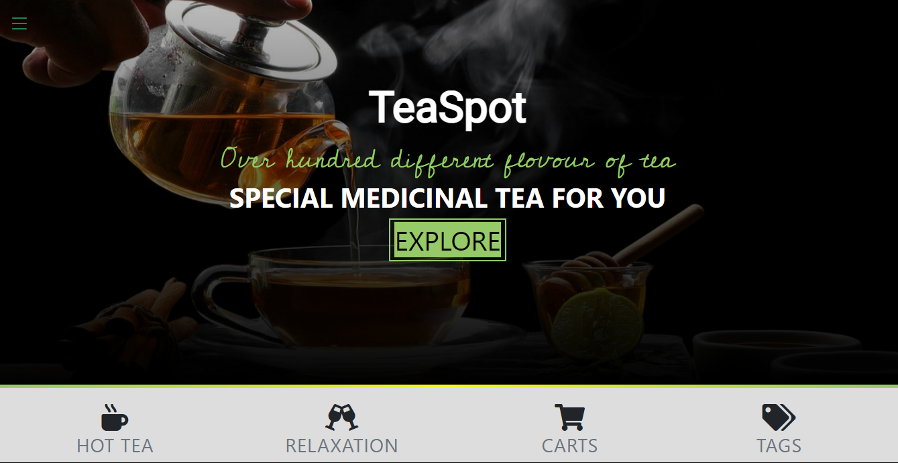
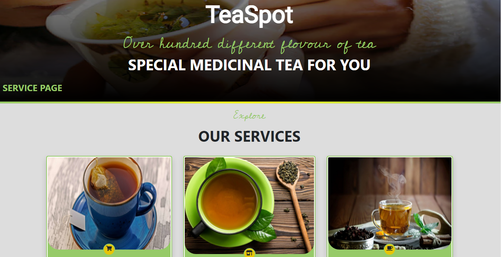

# TeaSpot - A quick tea buying spot 
# HTML & CSS capstone project (TeaSopt - A quick tea buying spot)
A responsive website built following the original project specifications from [Capstone Project - Tea Station](https://docs.google.com/document/d/1SW5rmE9Cl-8-Vm3qjBy8GMyMEd6kbl0RLatAM7iChzE/edit#heading=h.uzzkuipzhz6w)

### Main page

### Product page

### Service page

Project requirements included using semantic HTML tags, CSS selectors, HTML elements box model (margin, padding, width, height), Bootstrap, creating UIs adaptable to different screen sizes using mediaqueries and using industry-standard tools (flexbox) to place elements on the page.

The project has 3 web pages - the main page, the Product page and the Services page.

## Built With

- HTML5
- CSS3 Media Queries
- Bootstrap

## Live Demo

[Live Demo Link](https://yinktech.github.io/tea_shop)

## Author

* GitHub: [@YinkTech](https://github.com/YinkTech)
* Twitter: [@YinkTech](https://twitter.com/yinktech)
* Instagram: [@YinkTech](https://twitter.com/layinka4dat)
* LinkedIn: [Ayeni Olayinka](https://www.linkedin.com/in/ayeni-olayinka-726181134/)

## 🤝 Contributing

Contributions, issues, and feature requests are welcome!

Feel free to check the [issues page](https://github.com/YinkTech/tea_shop/issues).

## Show your support

Give a ⭐️ if you like this project!

